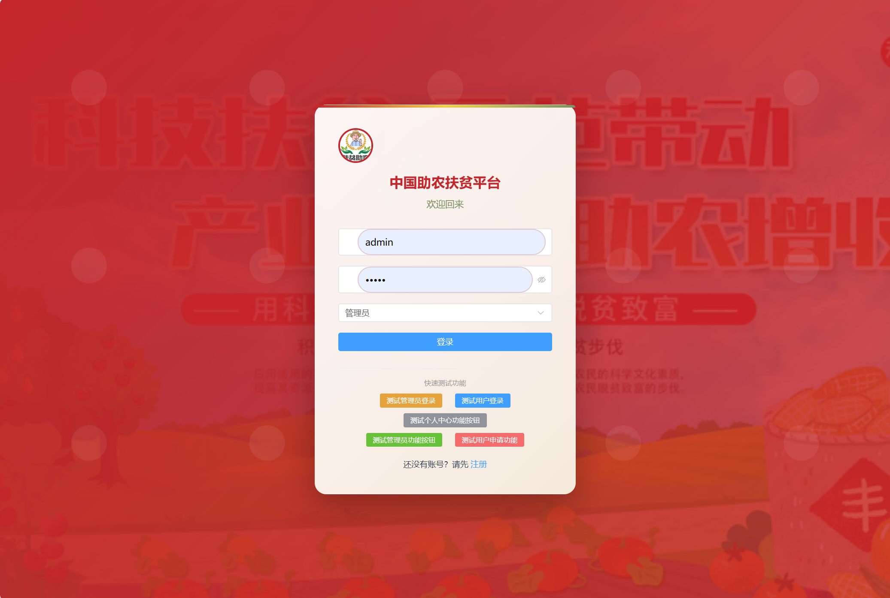

<div align="center">
  

  <h1 align="center">🌾 Agri-Aid Platform (助农援助平台)</h1>

  <p align="center">
    <strong>连接田间与指尖 · 智慧助农 · 数据赋能</strong>
  </p>

  <p align="center">
    <a href="#">
      
    </a>
    <a href="#">
      
    </a>
    <a href="#">
      
    </a>
  </p>
</div>

---

## 📖 项目简介 (Introduction)

**Agri-Aid Platform** 是一个综合性的智慧助农平台。我们致力于通过数字化手段，解决农产品供需信息不对称问题，为管理员提供强大的后台监控能力，为用户提供便捷的助农服务体验。

> 💡 **核心特性**：
> * **多角色支持**：完善的管理员 (Admin) 与普通用户 (User) 权限体系。
> * **数据可视化**：直观的后台仪表盘。
> * **沉浸式体验**：现代化的前端 UI 设计。

---

## 📸 视觉画廊 (Visual Showcase)

### 1. 门户首页 & 登录 (Portal & Authentication)
*简洁大气的门户设计，为用户提供舒适的第一印象。*

| 🏠 首页概览 | 🔐 安全登录 |
|:---:|:---:|
|  |  |

**更多首页细节：**
<div align="center">
    
    
    
</div>

---

### 2. 用户中心 (User Workflow)
*以用户为中心的操作流程，交互流畅自然。*

<div align="center">
  
</div>
<br>
<div align="center">
  
  
</div>

---

### 3. 管理员驾驶舱 (Admin Dashboard)
*上帝视角的数据监控，系统状态一目了然。*

<div align="center">
  
  <br><br>
  
</div>

---

## 🛠️ 技术架构 (Tech Stack)

* **前端 Engineering**: Vue.js, Element UI, Axios
* **后端 Engineering**: Spring Boot, MyBatis Plus
* **数据 Storage**: MySQL, Redis
* **工具 Tools**: Git, Maven

---

## 🚀 快速开始 (Quick Start)

```bash
# 1. 克隆项目
git clone git@github.com:HeyZhuang/agri-aid-platform.git

# 2. 进入项目目录
cd agri-aid-platform

# 3. 配置数据库 (请参考 sql 文件夹)
# ...

# 4. 启动服务
# ...

<div align="center"> <p>如果觉得这个项目对你有帮助，请给一个 ⭐️ Star 吧！</p> <p>Made with ❤️ by <strong>HeyZhuang</strong></p> </div>

-----
